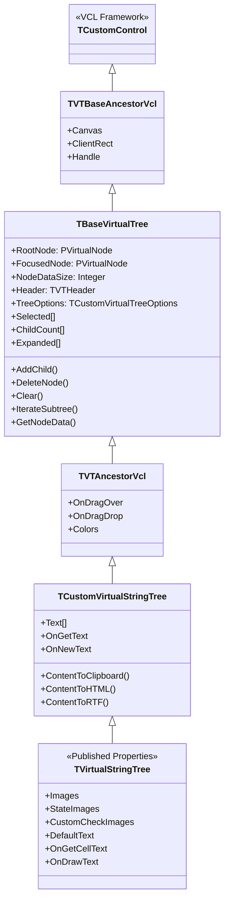
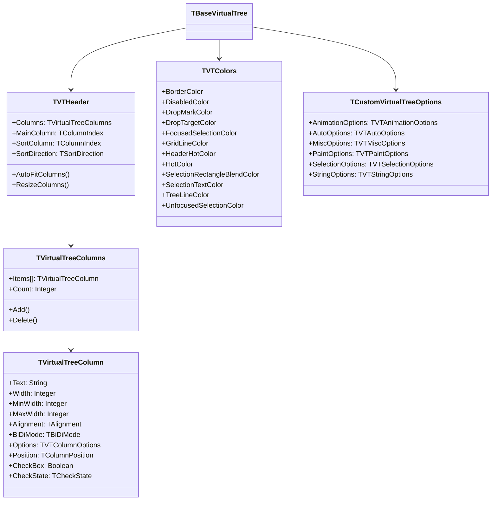
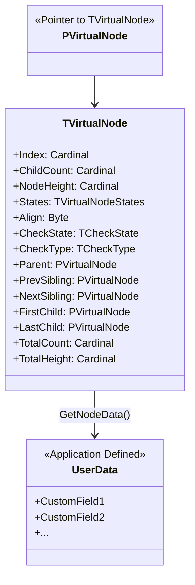

# TVirtualTreeView - Руководство для C++ Builder

## Оглавление
- [Введение](#введение)
- [Схема классов](#схема-классов)
- [Основные возможности](#основные-возможности)
- [Начало работы](#начало-работы)
- [Работа с данными узлов](#работа-с-данными-узлов)
- [Работа со столбцами](#работа-со-столбцами)
- [Сортировка данных](#сортировка-данных)
- [Фильтрация узлов](#фильтрация-узлов)
- [Раскраска ячеек](#раскраска-ячеек)
- [Редактирование данных](#редактирование-данных)
- [Перемещение и скрытие столбцов](#перемещение-и-скрытие-столбцов)
- [Отображение объектов в дереве](#отображение-объектов-в-дереве)
- [Drag & Drop](#drag--drop)
- [Примеры кода](#примеры-кода)

---

## Введение

**TVirtualTreeView** - это мощный компонент для отображения древовидных структур и таблиц данных в приложениях C++ Builder. Компонент использует виртуальный режим работы, что позволяет эффективно работать с миллионами узлов.

### Ключевые преимущества:
- Виртуальный режим - данные хранятся вне компонента
- Поддержка множества столбцов
- Встроенная поддержка редактирования
- Drag & Drop
- Множество настроек отображения
- Поддержка чекбоксов и радиокнопок
- Экспорт в различные форматы (HTML, RTF, CSV, XML)

---

## Схема классов

### Иерархия основных классов



### Основные вспомогательные классы



### Структура узла дерева



---

## Основные возможности

### 1. Виртуальный режим работы
Компонент не хранит данные внутри себя - вы управляете данными через события:
- `OnGetText` - предоставить текст для узла
- `OnInitNode` - инициализация нового узла
- `OnFreeNode` - освобождение данных узла

### 2. Множественные столбцы
- Поддержка неограниченного количества столбцов
- Изменение размера столбцов
- Перетаскивание столбцов
- Сортировка по столбцам
- Скрытие/показ столбцов

### 3. Редактирование
- Встроенные редакторы для текста
- Пользовательские редакторы для любых типов данных
- Редактирование по клику или двойному клику

### 4. Визуализация
- Линии связи между узлами
- Кнопки раскрытия/сворачивания
- Чекбоксы и радиокнопки
- Иконки для узлов
- Цветовая раскраска
- Поддержка тем Windows

### 5. Выделение и навигация
- Одиночное и множественное выделение
- Выделение прямоугольником
- Клавиатурная навигация
- Инкрементальный поиск

### 6. Drag & Drop
- Внутреннее перемещение узлов
- OLE Drag & Drop
- Визуальные индикаторы

### 7. Экспорт данных
- HTML
- RTF
- CSV
- Clipboard

---

## Начало работы

### Шаг 1: Добавление компонента

```cpp
// В файле заголовка (.h)
#include "VirtualTrees.hpp"

class TForm1 : public TForm
{
__published:
    TVirtualStringTree *VST;
    void __fastcall VSTGetText(TBaseVirtualTree *Sender, PVirtualNode Node,
        TColumnIndex Column, TVSTTextType TextType, UnicodeString &Text);
    void __fastcall VSTInitNode(TBaseVirtualTree *Sender,
        PVirtualNode ParentNode, PVirtualNode Node,
        TVirtualNodeInitStates &InitialStates);
    void __fastcall VSTFreeNode(TBaseVirtualTree *Sender, PVirtualNode Node);
    void __fastcall FormCreate(TObject *Sender);
};
```

### Шаг 2: Определение структуры данных

```cpp
// Структура данных для узла
struct TMyNodeData {
    UnicodeString Caption;
    int Value;
    TDateTime Date;

    // Конструктор
    TMyNodeData() : Value(0), Date(Now()) {}

    // Деструктор для очистки строк
    ~TMyNodeData() {
        Caption = "";
    }
};
typedef TMyNodeData *PMyNodeData;
```

### Шаг 3: Инициализация дерева

```cpp
void __fastcall TForm1::FormCreate(TObject *Sender)
{
    // Установка размера данных узла
    VST->NodeDataSize = sizeof(TMyNodeData);

    // Настройка опций дерева
    VST->TreeOptions->SelectionOptions =
        VST->TreeOptions->SelectionOptions << toMultiSelect;

    VST->TreeOptions->MiscOptions =
        VST->TreeOptions->MiscOptions << toEditable << toCheckSupport;

    // Добавление корневых узлов
    VST->RootNodeCount = 10;
}
```

### Шаг 4: Обработка событий

```cpp
// Инициализация узла
void __fastcall TForm1::VSTInitNode(TBaseVirtualTree *Sender,
    PVirtualNode ParentNode, PVirtualNode Node,
    TVirtualNodeInitStates &InitialStates)
{
    PMyNodeData Data = (PMyNodeData)Sender->GetNodeData(Node);

    Data->Caption = Format("Node %d", ARRAYOFCONST((Node->Index)));
    Data->Value = Node->Index * 10;
    Data->Date = Now();

    // Добавление дочерних узлов
    if (Sender->GetNodeLevel(Node) < 2) {
        InitialStates = InitialStates << ivsHasChildren;
    }
}

// Получение текста для отображения
void __fastcall TForm1::VSTGetText(TBaseVirtualTree *Sender,
    PVirtualNode Node, TColumnIndex Column, TVSTTextType TextType,
    UnicodeString &Text)
{
    PMyNodeData Data = (PMyNodeData)Sender->GetNodeData(Node);

    switch(Column) {
        case 0: // Первый столбец
            Text = Data->Caption;
            break;
        case 1: // Второй столбец
            Text = IntToStr(Data->Value);
            break;
        case 2: // Третий столбец
            Text = DateToStr(Data->Date);
            break;
    }
}

// Освобождение данных узла
void __fastcall TForm1::VSTFreeNode(TBaseVirtualTree *Sender,
    PVirtualNode Node)
{
    PMyNodeData Data = (PMyNodeData)Sender->GetNodeData(Node);
    // Вызов деструктора для очистки строк
    Data->~TMyNodeData();
}
```

---

## Работа с данными узлов

### Добавление узлов

```cpp
// Добавление корневого узла
PVirtualNode NewNode = VST->AddChild(NULL);

// Добавление дочернего узла
PVirtualNode ParentNode = VST->FocusedNode;
if (ParentNode != NULL) {
    PVirtualNode ChildNode = VST->AddChild(ParentNode);
    VST->Expanded[ParentNode] = true;
}

// Добавление узла в определенную позицию
PVirtualNode TargetNode = VST->FocusedNode;
PVirtualNode NewNode = VST->InsertNode(TargetNode, amInsertAfter);
```

### Удаление узлов

```cpp
// Удаление выбранного узла
if (VST->FocusedNode != NULL) {
    VST->DeleteNode(VST->FocusedNode);
}

// Удаление всех выбранных узлов
PVirtualNode Node = VST->GetFirstSelected();
while (Node != NULL) {
    PVirtualNode NextNode = VST->GetNextSelected(Node);
    VST->DeleteNode(Node);
    Node = NextNode;
}

// Очистка всего дерева
VST->Clear();
```

### Перебор узлов

```cpp
// Перебор всех узлов
PVirtualNode Node = VST->GetFirst();
while (Node != NULL) {
    PMyNodeData Data = (PMyNodeData)VST->GetNodeData(Node);
    // Обработка данных...

    Node = VST->GetNext(Node);
}

// Перебор только видимых узлов
Node = VST->GetFirstVisible(NULL, true);
while (Node != NULL) {
    // Обработка...
    Node = VST->GetNextVisible(Node, true);
}

// Перебор выбранных узлов
Node = VST->GetFirstSelected();
while (Node != NULL) {
    // Обработка...
    Node = VST->GetNextSelected(Node);
}

// Перебор дочерних узлов
PVirtualNode ParentNode = VST->FocusedNode;
if (ParentNode != NULL) {
    PVirtualNode Child = VST->GetFirstChild(ParentNode);
    while (Child != NULL) {
        // Обработка...
        Child = VST->GetNextSibling(Child);
    }
}
```

### Поиск узлов

```cpp
// Поиск узла с определенными данными
PVirtualNode FindNodeByValue(int SearchValue) {
    PVirtualNode Node = VST->GetFirst();
    while (Node != NULL) {
        PMyNodeData Data = (PMyNodeData)VST->GetNodeData(Node);
        if (Data->Value == SearchValue) {
            return Node;
        }
        Node = VST->GetNext(Node);
    }
    return NULL;
}

// Использование:
PVirtualNode Found = FindNodeByValue(50);
if (Found != NULL) {
    VST->FocusedNode = Found;
    VST->Selected[Found] = true;
    VST->ScrollIntoView(Found, false);
}
```

---

## Работа со столбцами

### Настройка столбцов в Design Time

```cpp
// Настройка через Object Inspector:
// 1. Выбрать компонент VST
// 2. Найти свойство Header->Options
// 3. Установить hoVisible = true
// 4. Кликнуть на Header->Columns
// 5. Добавить столбцы через редактор коллекции
```

### Настройка столбцов в Runtime

```cpp
void __fastcall TForm1::FormCreate(TObject *Sender)
{
    // Включение отображения заголовка
    VST->Header->Options = VST->Header->Options << hoVisible;

    // Очистка существующих столбцов
    VST->Header->Columns->Clear();

    // Добавление столбцов
    TVirtualTreeColumn *Col;

    // Столбец 1: Название
    Col = VST->Header->Columns->Add();
    Col->Text = "Название";
    Col->Width = 200;
    Col->Options = Col->Options << coResizable << coVisible;

    // Столбец 2: Значение
    Col = VST->Header->Columns->Add();
    Col->Text = "Значение";
    Col->Width = 100;
    Col->Alignment = taRightJustify;
    Col->Options = Col->Options << coResizable << coVisible;

    // Столбец 3: Дата
    Col = VST->Header->Columns->Add();
    Col->Text = "Дата";
    Col->Width = 120;
    Col->Options = Col->Options << coResizable << coVisible;

    // Установка главного столбца
    VST->Header->MainColumn = 0;
}
```

### Дополнительные настройки столбцов

```cpp
// Включение автоматического подбора ширины
VST->Header->AutoFitColumns(false);  // false = видимые столбцы

// Автоподбор для конкретного столбца
VST->Header->AutoFitColumns(false, smaUseColumnOption, 0, 2);

// Минимальная и максимальная ширина
VST->Header->Columns->Items[0]->MinWidth = 50;
VST->Header->Columns->Items[0]->MaxWidth = 400;

// Фиксированный столбец (не скроллируется)
VST->Header->Columns->Items[0]->Options =
    VST->Header->Columns->Items[0]->Options << coFixed;

// Опции заголовка
VST->Header->Options = VST->Header->Options
    << hoColumnResize      // Изменение размера
    << hoDrag              // Перетаскивание столбцов
    << hoShowSortGlyphs    // Индикатор сортировки
    << hoVisible           // Видимость заголовка
    << hoAutoResize        // Авто-размер последнего столбца
    << hoShowHint;         // Подсказки для заголовков
```

---

## Сортировка данных

### Базовая сортировка

```cpp
// Обработчик события OnCompareNodes
void __fastcall TForm1::VSTCompareNodes(TBaseVirtualTree *Sender,
    PVirtualNode Node1, PVirtualNode Node2, TColumnIndex Column, int &Result)
{
    PMyNodeData Data1 = (PMyNodeData)Sender->GetNodeData(Node1);
    PMyNodeData Data2 = (PMyNodeData)Sender->GetNodeData(Node2);

    switch(Column) {
        case 0: // Сортировка по тексту
            Result = CompareText(Data1->Caption, Data2->Caption);
            break;

        case 1: // Сортировка по числу
            if (Data1->Value < Data2->Value)
                Result = -1;
            else if (Data1->Value > Data2->Value)
                Result = 1;
            else
                Result = 0;
            break;

        case 2: // Сортировка по дате
            Result = CompareDateTime(Data1->Date, Data2->Date);
            break;

        default:
            Result = 0;
    }
}

// Обработчик клика по заголовку
void __fastcall TForm1::VSTHeaderClick(TVTHeader *Sender,
    TVTHeaderHitInfo HitInfo)
{
    if (HitInfo.Button == mbLeft) {
        // Изменение направления сортировки
        if (Sender->SortColumn == HitInfo.Column) {
            if (Sender->SortDirection == sdAscending)
                Sender->SortDirection = sdDescending;
            else
                Sender->SortDirection = sdAscending;
        }
        else {
            Sender->SortColumn = HitInfo.Column;
            Sender->SortDirection = sdAscending;
        }

        // Выполнение сортировки
        VST->SortTree(HitInfo.Column, Sender->SortDirection);
    }
}
```

### Автоматическая сортировка

```cpp
void __fastcall TForm1::FormCreate(TObject *Sender)
{
    // Включение автоматической сортировки
    VST->TreeOptions->AutoOptions =
        VST->TreeOptions->AutoOptions << toAutoSort;

    // Установка столбца и направления сортировки
    VST->Header->SortColumn = 0;
    VST->Header->SortDirection = sdAscending;
}
```

### Многоуровневая сортировка

```cpp
void __fastcall TForm1::VSTCompareNodes(TBaseVirtualTree *Sender,
    PVirtualNode Node1, PVirtualNode Node2, TColumnIndex Column, int &Result)
{
    PMyNodeData Data1 = (PMyNodeData)Sender->GetNodeData(Node1);
    PMyNodeData Data2 = (PMyNodeData)Sender->GetNodeData(Node2);

    // Первичная сортировка по основному столбцу
    Result = CompareText(Data1->Caption, Data2->Caption);

    // Вторичная сортировка при равенстве
    if (Result == 0) {
        if (Data1->Value < Data2->Value)
            Result = -1;
        else if (Data1->Value > Data2->Value)
            Result = 1;
    }
}
```

---

## Фильтрация узлов

### Простая фильтрация через видимость

```cpp
// Скрытие/показ узлов
void FilterNodes(UnicodeString FilterText) {
    VST->BeginUpdate();
    try {
        PVirtualNode Node = VST->GetFirst();
        while (Node != NULL) {
            PMyNodeData Data = (PMyNodeData)VST->GetNodeData(Node);

            // Проверка соответствия фильтру
            if (FilterText.IsEmpty() ||
                Data->Caption.Pos(FilterText) > 0) {
                VST->IsVisible[Node] = true;
            }
            else {
                VST->IsVisible[Node] = false;
            }

            Node = VST->GetNext(Node);
        }
    }
    __finally {
        VST->EndUpdate();
    }
}

// Использование:
void __fastcall TForm1::EditFilterChange(TObject *Sender)
{
    FilterNodes(EditFilter->Text);
}
```

### Фильтрация с использованием флага vsFiltered

```cpp
void __fastcall TForm1::ApplyFilter(UnicodeString FilterText)
{
    VST->BeginUpdate();
    try {
        PVirtualNode Node = VST->GetFirst();
        while (Node != NULL) {
            PMyNodeData Data = (PMyNodeData)VST->GetNodeData(Node);

            if (FilterText.IsEmpty() ||
                Data->Caption.Pos(FilterText) > 0) {
                // Узел проходит фильтр
                Node->States = Node->States >> vsFiltered;
            }
            else {
                // Узел не проходит фильтр
                Node->States = Node->States << vsFiltered;
            }

            Node = VST->GetNext(Node);
        }
    }
    __finally {
        VST->EndUpdate();
    }
}

// Настройка отображения отфильтрованных узлов
void __fastcall TForm1::FormCreate(TObject *Sender)
{
    // Скрыть отфильтрованные узлы
    VST->TreeOptions->PaintOptions =
        VST->TreeOptions->PaintOptions >> toShowFilteredNodes;
}
```

### Сложная фильтрация

```cpp
struct TFilterCriteria {
    UnicodeString TextFilter;
    int MinValue;
    int MaxValue;
    TDateTime DateFrom;
    TDateTime DateTo;
    bool UseValueFilter;
    bool UseDateFilter;
};

void ApplyComplexFilter(TFilterCriteria &Criteria) {
    VST->BeginUpdate();
    try {
        PVirtualNode Node = VST->GetFirst();
        while (Node != NULL) {
            PMyNodeData Data = (PMyNodeData)VST->GetNodeData(Node);
            bool PassFilter = true;

            // Фильтр по тексту
            if (!Criteria.TextFilter.IsEmpty()) {
                if (Data->Caption.Pos(Criteria.TextFilter) == 0) {
                    PassFilter = false;
                }
            }

            // Фильтр по значению
            if (PassFilter && Criteria.UseValueFilter) {
                if (Data->Value < Criteria.MinValue ||
                    Data->Value > Criteria.MaxValue) {
                    PassFilter = false;
                }
            }

            // Фильтр по дате
            if (PassFilter && Criteria.UseDateFilter) {
                if (Data->Date < Criteria.DateFrom ||
                    Data->Date > Criteria.DateTo) {
                    PassFilter = false;
                }
            }

            VST->IsVisible[Node] = PassFilter;
            Node = VST->GetNext(Node);
        }
    }
    __finally {
        VST->EndUpdate();
    }
}
```

---

## Раскраска ячеек

### Раскраска фона узла

```cpp
// Событие OnBeforeItemErase - раскраска всей строки
void __fastcall TForm1::VSTBeforeItemErase(TBaseVirtualTree *Sender,
    TCanvas *TargetCanvas, PVirtualNode Node, TRect &ItemRect,
    TColor &Color, TItemEraseAction &EraseAction)
{
    PMyNodeData Data = (PMyNodeData)Sender->GetNodeData(Node);

    // Раскраска четных/нечетных строк
    if (Node->Index % 2 == 0) {
        Color = clWhite;
    }
    else {
        Color = (TColor)0xF0F0F0;  // Светло-серый
    }

    // Раскраска на основе данных
    if (Data->Value > 100) {
        Color = (TColor)0xCCFFCC;  // Светло-зеленый
    }
    else if (Data->Value < 0) {
        Color = (TColor)0xCCCCFF;  // Светло-красный
    }

    EraseAction = eaColor;
}
```

### Раскраска отдельных ячеек

```cpp
// Событие OnBeforeCellPaint - раскраска конкретных ячеек
void __fastcall TForm1::VSTBeforeCellPaint(TBaseVirtualTree *Sender,
    TCanvas *TargetCanvas, PVirtualNode Node, TColumnIndex Column,
    TVTCellPaintMode CellPaintMode, TRect &CellRect, TRect &ContentRect)
{
    PMyNodeData Data = (PMyNodeData)Sender->GetNodeData(Node);

    // Не раскрашиваем фокусную ячейку
    if ((Column == Sender->FocusedColumn) && (Node == Sender->FocusedNode)) {
        return;
    }

    // Раскраска на основе столбца и значения
    if (Column == 1) {  // Столбец со значением
        if (Data->Value > 100) {
            TargetCanvas->Brush->Color = (TColor)0xCCFFCC;
        }
        else if (Data->Value < 0) {
            TargetCanvas->Brush->Color = (TColor)0xCCCCFF;
        }
        else {
            return;  // Не раскрашиваем
        }

        TargetCanvas->FillRect(CellRect);
    }
}
```

### Раскраска текста

```cpp
// Событие OnPaintText - изменение цвета и стиля текста
void __fastcall TForm1::VSTPaintText(TBaseVirtualTree *Sender,
    const TCanvas *TargetCanvas, PVirtualNode Node, TColumnIndex Column,
    TVSTTextType TextType)
{
    PMyNodeData Data = (PMyNodeData)Sender->GetNodeData(Node);

    switch(Column) {
        case 0:  // Главный столбец
            if (Sender->GetNodeLevel(Node) == 0) {
                // Корневые узлы - жирный шрифт
                TargetCanvas->Font->Style = TFontStyles() << fsBold;
                TargetCanvas->Font->Color = clNavy;
            }
            break;

        case 1:  // Столбец значений
            if (Data->Value > 100) {
                TargetCanvas->Font->Color = clGreen;
                TargetCanvas->Font->Style = TFontStyles() << fsBold;
            }
            else if (Data->Value < 0) {
                TargetCanvas->Font->Color = clRed;
                TargetCanvas->Font->Style = TFontStyles() << fsItalic;
            }
            break;
    }
}
```

### Продвинутая раскраска

```cpp
// Комбинированная раскраска с градиентом
void __fastcall TForm1::VSTAfterCellPaint(TBaseVirtualTree *Sender,
    TCanvas *TargetCanvas, PVirtualNode Node, TColumnIndex Column,
    TRect &CellRect)
{
    if (Column == 1) {
        PMyNodeData Data = (PMyNodeData)Sender->GetNodeData(Node);

        // Рисуем progress bar в ячейке
        if (Data->Value > 0 && Data->Value <= 100) {
            TRect ProgressRect = CellRect;
            InflateRect(&ProgressRect, -2, -2);

            // Фон
            TargetCanvas->Brush->Color = clWhite;
            TargetCanvas->FillRect(ProgressRect);

            // Progress
            ProgressRect.Right = ProgressRect.Left +
                (ProgressRect.Right - ProgressRect.Left) * Data->Value / 100;

            TargetCanvas->Brush->Color = clSkyBlue;
            TargetCanvas->FillRect(ProgressRect);

            // Рамка
            TargetCanvas->Brush->Style = bsClear;
            TargetCanvas->Pen->Color = clGray;
            TargetCanvas->Rectangle(CellRect.Left + 2, CellRect.Top + 2,
                                   CellRect.Right - 2, CellRect.Bottom - 2);
        }
    }
}
```

---

## Редактирование данных

### Встроенное редактирование текста

```cpp
void __fastcall TForm1::FormCreate(TObject *Sender)
{
    // Включение редактирования
    VST->TreeOptions->MiscOptions =
        VST->TreeOptions->MiscOptions << toEditable;

    // Редактирование по одному клику (опционально)
    VST->TreeOptions->MiscOptions =
        VST->TreeOptions->MiscOptions << toEditOnClick;
}

// Обработка нового значения
void __fastcall TForm1::VSTNewText(TBaseVirtualTree *Sender,
    PVirtualNode Node, TColumnIndex Column, UnicodeString NewText)
{
    PMyNodeData Data = (PMyNodeData)Sender->GetNodeData(Node);

    switch(Column) {
        case 0:
            Data->Caption = NewText;
            break;

        case 1:
            try {
                Data->Value = StrToInt(NewText);
            }
            catch(...) {
                ShowMessage("Неверное числовое значение!");
            }
            break;
    }
}
```

### Пользовательский редактор

```cpp
// Определение класса редактора
class TMyEditLink : public IVTEditLink
{
private:
    TEdit *FEdit;
    TBaseVirtualTree *FTree;
    PVirtualNode FNode;
    TColumnIndex FColumn;

public:
    // Конструктор
    TMyEditLink() : FEdit(NULL), FTree(NULL), FNode(NULL), FColumn(-1) {}

    // Деструктор
    ~TMyEditLink() {
        if (FEdit != NULL) {
            delete FEdit;
        }
    }

    // Подготовка редактора
    bool __stdcall PrepareEdit(TBaseVirtualTree *Tree, PVirtualNode Node,
        TColumnIndex Column)
    {
        FTree = Tree;
        FNode = Node;
        FColumn = Column;

        FEdit = new TEdit(Tree);
        FEdit->Visible = false;
        FEdit->Parent = Tree;

        return true;
    }

    // Начало редактирования
    bool __stdcall BeginEdit()
    {
        FEdit->Show();
        FEdit->SetFocus();

        // Загрузка текущего значения
        UnicodeString Text;
        FTree->OnGetText(FTree, FNode, FColumn, ttNormal, Text);
        FEdit->Text = Text;
        FEdit->SelectAll();

        return true;
    }

    // Завершение редактирования
    bool __stdcall EndEdit()
    {
        UnicodeString NewText = FEdit->Text;
        FTree->OnNewText(FTree, FNode, FColumn, NewText);
        return true;
    }

    // Отмена редактирования
    bool __stdcall CancelEdit()
    {
        return true;
    }

    // Обработка сообщений
    void __stdcall ProcessMessage(TMessage &Message)
    {
        FEdit->WindowProc(Message);
    }

    // Установка границ редактора
    void __stdcall SetBounds(TRect R)
    {
        FEdit->BoundsRect = R;
    }
};

// Создание редактора
void __fastcall TForm1::VSTCreateEditor(TBaseVirtualTree *Sender,
    PVirtualNode Node, TColumnIndex Column, IVTEditLink &EditLink)
{
    EditLink = new TMyEditLink();
}
```

### Редактор с выпадающим списком

```cpp
class TComboEditLink : public IVTEditLink
{
private:
    TComboBox *FCombo;
    TBaseVirtualTree *FTree;
    PVirtualNode FNode;
    TColumnIndex FColumn;

public:
    TComboEditLink() : FCombo(NULL), FTree(NULL), FNode(NULL), FColumn(-1) {}

    ~TComboEditLink() {
        if (FCombo != NULL) delete FCombo;
    }

    bool __stdcall PrepareEdit(TBaseVirtualTree *Tree, PVirtualNode Node,
        TColumnIndex Column)
    {
        FTree = Tree;
        FNode = Node;
        FColumn = Column;

        FCombo = new TComboBox(Tree);
        FCombo->Visible = false;
        FCombo->Parent = Tree;
        FCombo->Style = csDropDownList;

        // Заполнение списка
        FCombo->Items->Add("Вариант 1");
        FCombo->Items->Add("Вариант 2");
        FCombo->Items->Add("Вариант 3");

        return true;
    }

    bool __stdcall BeginEdit()
    {
        FCombo->Show();
        FCombo->SetFocus();

        // Установка текущего значения
        UnicodeString Text;
        FTree->OnGetText(FTree, FNode, FColumn, ttNormal, Text);
        FCombo->ItemIndex = FCombo->Items->IndexOf(Text);

        if (FCombo->ItemIndex < 0 && FCombo->Items->Count > 0) {
            FCombo->ItemIndex = 0;
        }

        FCombo->DroppedDown = true;

        return true;
    }

    bool __stdcall EndEdit()
    {
        if (FCombo->ItemIndex >= 0) {
            UnicodeString NewText = FCombo->Items->Strings[FCombo->ItemIndex];
            FTree->OnNewText(FTree, FNode, FColumn, NewText);
        }
        return true;
    }

    bool __stdcall CancelEdit()
    {
        return true;
    }

    void __stdcall ProcessMessage(TMessage &Message)
    {
        FCombo->WindowProc(Message);
    }

    void __stdcall SetBounds(TRect R)
    {
        FCombo->BoundsRect = R;
    }
};
```

---

## Перемещение и скрытие столбцов

### Перемещение столбцов

```cpp
void __fastcall TForm1::FormCreate(TObject *Sender)
{
    // Включение перетаскивания столбцов
    VST->Header->Options = VST->Header->Options << hoDrag;
}

// Обработка перетаскивания
void __fastcall TForm1::VSTHeaderDragged(TVTHeader *Sender,
    TColumnIndex Column, int OldPosition)
{
    // Столбец был перемещен
    ShowMessage(Format("Столбец %d перемещен с позиции %d на %d",
        ARRAYOFCONST((Column, OldPosition,
        Sender->Columns->Items[Column]->Position))));
}

// Запрет перетаскивания конкретного столбца
void __fastcall TForm1::VSTHeaderDragging(TVTHeader *Sender,
    TColumnIndex Column, bool &Allowed)
{
    // Не разрешаем перетаскивать первый столбец
    if (Column == 0) {
        Allowed = false;
    }
}
```

### Скрытие/показ столбцов

```cpp
// Скрытие столбца
VST->Header->Columns->Items[1]->Options =
    VST->Header->Columns->Items[1]->Options >> coVisible;

// Показ столбца
VST->Header->Columns->Items[1]->Options =
    VST->Header->Columns->Items[1]->Options << coVisible;

// Переключение видимости
TVirtualTreeColumn *Col = VST->Header->Columns->Items[1];
if (Col->Options.Contains(coVisible)) {
    Col->Options = Col->Options >> coVisible;
}
else {
    Col->Options = Col->Options << coVisible;
}
```

### Контекстное меню для работы со столбцами

```cpp
// Использование TVTHeaderPopupMenu
void __fastcall TForm1::FormCreate(TObject *Sender)
{
    TVTHeaderPopupMenu *HeaderPopup = new TVTHeaderPopupMenu(this);
    HeaderPopup->PopupComponent = VST;

    // Опции меню
    HeaderPopup->Options =
        HeaderPopup->Options << poAllowHideAll;
}

// Или создание собственного меню
void __fastcall TForm1::ShowColumnMenu(TPoint Position)
{
    TPopupMenu *Menu = new TPopupMenu(this);

    for (int i = 0; i < VST->Header->Columns->Count; i++) {
        TVirtualTreeColumn *Col = VST->Header->Columns->Items[i];
        TMenuItem *Item = new TMenuItem(Menu);
        Item->Caption = Col->Text;
        Item->Tag = i;
        Item->Checked = Col->Options.Contains(coVisible);
        Item->OnClick = ColumnMenuItemClick;
        Menu->Items->Add(Item);
    }

    Menu->Popup(Position.X, Position.Y);
}

void __fastcall TForm1::ColumnMenuItemClick(TObject *Sender)
{
    TMenuItem *Item = (TMenuItem*)Sender;
    int ColIndex = Item->Tag;

    TVirtualTreeColumn *Col = VST->Header->Columns->Items[ColIndex];
    if (Col->Options.Contains(coVisible)) {
        Col->Options = Col->Options >> coVisible;
    }
    else {
        Col->Options = Col->Options << coVisible;
    }
}
```

### Изменение порядка столбцов программно

```cpp
// Установка позиции столбца
VST->Header->Columns->Items[2]->Position = 0;

// Обмен позиций двух столбцов
void SwapColumns(int Index1, int Index2) {
    int Pos1 = VST->Header->Columns->Items[Index1]->Position;
    int Pos2 = VST->Header->Columns->Items[Index2]->Position;

    VST->Header->Columns->Items[Index1]->Position = Pos2;
    VST->Header->Columns->Items[Index2]->Position = Pos1;
}
```

---

## Отображение объектов в дереве

### Способ 1: Хранение указателя на объект

```cpp
// Класс данных
class TCustomer {
public:
    UnicodeString Name;
    UnicodeString Address;
    int Age;
    TDateTime RegisterDate;

    TCustomer(UnicodeString AName, UnicodeString AAddress, int AAge) {
        Name = AName;
        Address = AAddress;
        Age = AAge;
        RegisterDate = Now();
    }
};

// Структура узла - только указатель
struct TNodeData {
    TCustomer *Customer;
};
typedef TNodeData *PNodeData;

// Инициализация
void __fastcall TForm1::FormCreate(TObject *Sender)
{
    VST->NodeDataSize = sizeof(TNodeData);

    // Создание объектов и добавление в дерево
    TCustomer *Cust1 = new TCustomer("Иванов И.И.", "Москва", 30);
    AddCustomerNode(Cust1);

    TCustomer *Cust2 = new TCustomer("Петров П.П.", "С-Петербург", 25);
    AddCustomerNode(Cust2);
}

void __fastcall TForm1::AddCustomerNode(TCustomer *Customer)
{
    PVirtualNode Node = VST->AddChild(NULL);
    PNodeData Data = (PNodeData)VST->GetNodeData(Node);
    Data->Customer = Customer;
}

// Отображение данных
void __fastcall TForm1::VSTGetText(TBaseVirtualTree *Sender,
    PVirtualNode Node, TColumnIndex Column, TVSTTextType TextType,
    UnicodeString &Text)
{
    PNodeData Data = (PNodeData)Sender->GetNodeData(Node);
    TCustomer *Cust = Data->Customer;

    if (Cust != NULL) {
        switch(Column) {
            case 0: Text = Cust->Name; break;
            case 1: Text = Cust->Address; break;
            case 2: Text = IntToStr(Cust->Age); break;
            case 3: Text = DateToStr(Cust->RegisterDate); break;
        }
    }
}

// Освобождение
void __fastcall TForm1::VSTFreeNode(TBaseVirtualTree *Sender,
    PVirtualNode Node)
{
    PNodeData Data = (PNodeData)Sender->GetNodeData(Node);
    if (Data->Customer != NULL) {
        delete Data->Customer;
        Data->Customer = NULL;
    }
}
```

### Способ 2: Хранение данных в узле

```cpp
// Полная копия данных в узле
struct TCustomerData {
    UnicodeString Name;
    UnicodeString Address;
    int Age;
    TDateTime RegisterDate;

    ~TCustomerData() {
        Name = "";
        Address = "";
    }
};
typedef TCustomerData *PCustomerData;

// Копирование данных в узел
void __fastcall TForm1::AddCustomer(UnicodeString Name,
    UnicodeString Address, int Age)
{
    PVirtualNode Node = VST->AddChild(NULL);
    PCustomerData Data = (PCustomerData)VST->GetNodeData(Node);

    Data->Name = Name;
    Data->Address = Address;
    Data->Age = Age;
    Data->RegisterDate = Now();
}
```

### Способ 3: Использование коллекций

```cpp
// Глобальный список объектов
TList *CustomerList;

// Структура узла - только индекс
struct TNodeData {
    int CustomerIndex;
};
typedef TNodeData *PNodeData;

// Инициализация
void __fastcall TForm1::FormCreate(TObject *Sender)
{
    VST->NodeDataSize = sizeof(TNodeData);
    CustomerList = new TList();

    // Добавление объектов
    TCustomer *Cust1 = new TCustomer("Иванов И.И.", "Москва", 30);
    int Index1 = CustomerList->Add(Cust1);
    AddCustomerNode(Index1);
}

void __fastcall TForm1::AddCustomerNode(int CustomerIndex)
{
    PVirtualNode Node = VST->AddChild(NULL);
    PNodeData Data = (PNodeData)VST->GetNodeData(Node);
    Data->CustomerIndex = CustomerIndex;
}

// Получение объекта
TCustomer* GetCustomer(PVirtualNode Node) {
    PNodeData Data = (PNodeData)VST->GetNodeData(Node);
    if (Data->CustomerIndex >= 0 && Data->CustomerIndex < CustomerList->Count) {
        return (TCustomer*)CustomerList->Items[Data->CustomerIndex];
    }
    return NULL;
}

// Отображение
void __fastcall TForm1::VSTGetText(TBaseVirtualTree *Sender,
    PVirtualNode Node, TColumnIndex Column, TVSTTextType TextType,
    UnicodeString &Text)
{
    TCustomer *Cust = GetCustomer(Node);
    if (Cust != NULL) {
        switch(Column) {
            case 0: Text = Cust->Name; break;
            case 1: Text = Cust->Address; break;
            // и т.д.
        }
    }
}

// Очистка
void __fastcall TForm1::FormDestroy(TObject *Sender)
{
    for (int i = 0; i < CustomerList->Count; i++) {
        delete (TCustomer*)CustomerList->Items[i];
    }
    delete CustomerList;
}
```

### Иерархические данные

```cpp
class TDepartment {
public:
    UnicodeString Name;
    TList *Employees;  // Список сотрудников

    TDepartment(UnicodeString AName) {
        Name = AName;
        Employees = new TList();
    }

    ~TDepartment() {
        for (int i = 0; i < Employees->Count; i++) {
            delete (TEmployee*)Employees->Items[i];
        }
        delete Employees;
    }
};

class TEmployee {
public:
    UnicodeString Name;
    UnicodeString Position;
};

// Добавление иерархии
void __fastcall TForm1::BuildTree()
{
    VST->BeginUpdate();
    try {
        TDepartment *Dept1 = new TDepartment("IT");
        PVirtualNode DeptNode = AddDepartmentNode(Dept1);

        TEmployee *Emp1 = new TEmployee();
        Emp1->Name = "Иванов";
        Emp1->Position = "Программист";
        Dept1->Employees->Add(Emp1);

        AddEmployeeNode(DeptNode, Emp1);

        VST->Expanded[DeptNode] = true;
    }
    __finally {
        VST->EndUpdate();
    }
}
```

---

## Drag & Drop

### Внутреннее перемещение узлов

```cpp
void __fastcall TForm1::FormCreate(TObject *Sender)
{
    // Включение Drag & Drop
    VST->TreeOptions->MiscOptions =
        VST->TreeOptions->MiscOptions << toAutoDeleteMovedNodes;

    // Режим перетаскивания
    VST->DragMode = dmAutomatic;
    VST->DragType = dtVCL;
}

// Разрешение перетаскивания узла
void __fastcall TForm1::VSTDragAllowed(TBaseVirtualTree *Sender,
    PVirtualNode Node, TColumnIndex Column, bool &Allowed)
{
    // Можно запретить перетаскивание определенных узлов
    Allowed = true;
}

// Обработка перетаскивания
void __fastcall TForm1::VSTDragOver(TBaseVirtualTree *Sender,
    TObject *Source, TShiftState Shift, TDragState State, TPoint Pt,
    TDropMode Mode, int &Effect, bool &Accept)
{
    // Разрешить drop только на узлы, а не между ними
    Accept = (Mode == dmOnNode);

    // Или только между узлами
    // Accept = (Mode == dmAbove) || (Mode == dmBelow);
}

// Обработка drop
void __fastcall TForm1::VSTDragDrop(TBaseVirtualTree *Sender,
    TObject *Source, TDataObject DataObject, TFormatArray Formats,
    TShiftState Shift, TPoint Pt, int &Effect, TDropMode Mode)
{
    // Автоматическое перемещение узлов
    // (обрабатывается компонентом, если включен toAutoDeleteMovedNodes)
}

// Реакция на перемещение
void __fastcall TForm1::VSTNodeMoved(TBaseVirtualTree *Sender,
    PVirtualNode Node)
{
    // Узел был перемещен
    PMyNodeData Data = (PMyNodeData)Sender->GetNodeData(Node);
    ShowMessage(Format("Узел '%s' перемещен", ARRAYOFCONST((Data->Caption))));
}
```

### OLE Drag & Drop

```cpp
void __fastcall TForm1::FormCreate(TObject *Sender)
{
    // Включение OLE Drag & Drop
    VST->TreeOptions->MiscOptions =
        VST->TreeOptions->MiscOptions << toAcceptOLEDrop;

    VST->DragMode = dmAutomatic;
    VST->DragType = dtOLE;
}

// Создание data object для OLE
void __fastcall TForm1::VSTCreateDataObject(TBaseVirtualTree *Sender,
    IDataObject &IDataObject)
{
    // Компонент создает стандартный data object
    // Можно добавить собственные форматы данных
}

// Получение форматов для clipboard
void __fastcall TForm1::VSTGetUserClipboardFormats(
    TBaseVirtualTree *Sender, TFormatEtcArray &Formats)
{
    // Добавление пользовательских форматов
}
```

### Drag & Drop между разными деревьями

```cpp
// VST1 -> VST2
void __fastcall TForm1::VST1DragOver(TBaseVirtualTree *Sender,
    TObject *Source, TShiftState Shift, TDragState State, TPoint Pt,
    TDropMode Mode, int &Effect, bool &Accept)
{
    // Разрешаем drop только от VST2
    Accept = (Source == VST2);
}

void __fastcall TForm1::VST1DragDrop(TBaseVirtualTree *Sender,
    TObject *Source, TDataObject DataObject, TFormatArray Formats,
    TShiftState Shift, TPoint Pt, int &Effect, TDropMode Mode)
{
    if (Source == VST2) {
        // Копирование узлов из VST2 в VST1
        PVirtualNode SourceNode = VST2->GetFirstSelected();
        while (SourceNode != NULL) {
            CopyNode(VST2, SourceNode, Sender, Sender->DropTargetNode);
            SourceNode = VST2->GetNextSelected(SourceNode);
        }
    }
}

void CopyNode(TBaseVirtualTree *SourceTree, PVirtualNode SourceNode,
    TBaseVirtualTree *TargetTree, PVirtualNode TargetNode)
{
    PVirtualNode NewNode = TargetTree->AddChild(TargetNode);

    // Копирование данных
    PMyNodeData SourceData = (PMyNodeData)SourceTree->GetNodeData(SourceNode);
    PMyNodeData TargetData = (PMyNodeData)TargetTree->GetNodeData(NewNode);

    *TargetData = *SourceData;
}
```

---

## Примеры кода

### Пример 1: Простое дерево файловой системы

```cpp
// Заголовочный файл
class TForm1 : public TForm
{
__published:
    TVirtualStringTree *VST;
    void __fastcall FormCreate(TObject *Sender);
    void __fastcall VSTGetText(TBaseVirtualTree *Sender, PVirtualNode Node,
        TColumnIndex Column, TVSTTextType TextType, UnicodeString &Text);
    void __fastcall VSTInitNode(TBaseVirtualTree *Sender,
        PVirtualNode ParentNode, PVirtualNode Node,
        TVirtualNodeInitStates &InitialStates);
    void __fastcall VSTInitChildren(TBaseVirtualTree *Sender,
        PVirtualNode Node, Cardinal &ChildCount);
    void __fastcall VSTGetImageIndex(TBaseVirtualTree *Sender,
        PVirtualNode Node, TVTImageKind Kind, TColumnIndex Column,
        bool &Ghosted, TImageIndex &ImageIndex);
};

// Структура данных
struct TFileData {
    UnicodeString FileName;
    bool IsDirectory;
    __int64 Size;

    ~TFileData() {
        FileName = "";
    }
};
typedef TFileData *PFileData;

// Реализация
void __fastcall TForm1::FormCreate(TObject *Sender)
{
    VST->NodeDataSize = sizeof(TFileData);
    VST->RootNodeCount = 1;

    // Настройка столбцов
    VST->Header->Options = VST->Header->Options << hoVisible;
    VST->Header->Columns->Clear();

    TVirtualTreeColumn *Col;
    Col = VST->Header->Columns->Add();
    Col->Text = "Имя";
    Col->Width = 200;

    Col = VST->Header->Columns->Add();
    Col->Text = "Размер";
    Col->Width = 100;
    Col->Alignment = taRightJustify;
}

void __fastcall TForm1::VSTInitNode(TBaseVirtualTree *Sender,
    PVirtualNode ParentNode, PVirtualNode Node,
    TVirtualNodeInitStates &InitialStates)
{
    PFileData Data = (PFileData)Sender->GetNodeData(Node);

    if (ParentNode == NULL) {
        // Корневой узел - диск C:
        Data->FileName = "C:\\";
        Data->IsDirectory = true;
        Data->Size = 0;
        InitialStates = InitialStates << ivsHasChildren;
    }
    else {
        // Дочерние узлы будут инициализированы в OnInitChildren
    }
}

void __fastcall TForm1::VSTInitChildren(TBaseVirtualTree *Sender,
    PVirtualNode Node, Cardinal &ChildCount)
{
    PFileData Data = (PFileData)Sender->GetNodeData(Node);

    if (Data->IsDirectory) {
        UnicodeString Path = Data->FileName;
        TSearchRec SR;

        ChildCount = 0;
        if (FindFirst(Path + "*.*", faAnyFile, SR) == 0) {
            do {
                if ((SR.Name != ".") && (SR.Name != "..")) {
                    ChildCount++;
                }
            } while (FindNext(SR) == 0);
            FindClose(SR);
        }
    }
}

void __fastcall TForm1::VSTGetText(TBaseVirtualTree *Sender,
    PVirtualNode Node, TColumnIndex Column, TVSTTextType TextType,
    UnicodeString &Text)
{
    PFileData Data = (PFileData)Sender->GetNodeData(Node);

    switch(Column) {
        case 0:
            Text = ExtractFileName(Data->FileName);
            break;
        case 1:
            if (!Data->IsDirectory) {
                Text = FormatFloat("#,##0", Data->Size);
            }
            break;
    }
}
```

### Пример 2: Дерево с чекбоксами

```cpp
void __fastcall TForm1::FormCreate(TObject *Sender)
{
    VST->NodeDataSize = sizeof(TMyNodeData);

    // Включение чекбоксов
    VST->TreeOptions->MiscOptions =
        VST->TreeOptions->MiscOptions << toCheckSupport;

    // Автоматическое обновление состояния родителей/детей
    VST->TreeOptions->AutoOptions =
        VST->TreeOptions->AutoOptions << toAutoTristateTracking;

    VST->RootNodeCount = 5;
}

void __fastcall TForm1::VSTInitNode(TBaseVirtualTree *Sender,
    PVirtualNode ParentNode, PVirtualNode Node,
    TVirtualNodeInitStates &InitialStates)
{
    // Установка типа чекбокса
    Node->CheckType = ctTriStateCheckBox;

    // Установка начального состояния
    Sender->CheckState[Node] = csUncheckedNormal;

    // Добавление дочерних узлов
    if (Sender->GetNodeLevel(Node) < 2) {
        InitialStates = InitialStates << ivsHasChildren;
    }
}

// Получение всех отмеченных узлов
void __fastcall TForm1::GetCheckedNodes()
{
    TStringList *CheckedItems = new TStringList();
    try {
        PVirtualNode Node = VST->GetFirstChecked();
        while (Node != NULL) {
            PMyNodeData Data = (PMyNodeData)VST->GetNodeData(Node);
            CheckedItems->Add(Data->Caption);
            Node = VST->GetNextChecked(Node);
        }

        ShowMessage("Отмечено элементов: " +
            IntToStr(CheckedItems->Count));
    }
    __finally {
        delete CheckedItems;
    }
}
```

### Пример 3: Grid режим

```cpp
void __fastcall TForm1::FormCreate(TObject *Sender)
{
    VST->NodeDataSize = sizeof(TGridData);

    // Включение grid режима
    VST->TreeOptions->MiscOptions =
        VST->TreeOptions->MiscOptions
        << toGridExtensions << toEditable;

    // Настройка выделения
    VST->TreeOptions->SelectionOptions =
        VST->TreeOptions->SelectionOptions
        << toExtendedFocus << toFullRowSelect;

    // Отключение линий дерева
    VST->TreeOptions->PaintOptions =
        VST->TreeOptions->PaintOptions
        >> toShowTreeLines >> toShowRoot;

    // Включение линий сетки
    VST->TreeOptions->PaintOptions =
        VST->TreeOptions->PaintOptions
        << toShowHorzGridLines << toShowVertGridLines;

    // Настройка столбцов
    SetupGridColumns();

    // Добавление строк
    VST->RootNodeCount = 100;
}

void __fastcall TForm1::SetupGridColumns()
{
    VST->Header->Options = VST->Header->Options << hoVisible;
    VST->Header->Columns->Clear();

    TVirtualTreeColumn *Col;

    // Столбец с номером строки (фиксированный)
    Col = VST->Header->Columns->Add();
    Col->Text = "#";
    Col->Width = 50;
    Col->Options = Col->Options << coFixed >> coResizable;

    Col = VST->Header->Columns->Add();
    Col->Text = "Имя";
    Col->Width = 150;

    Col = VST->Header->Columns->Add();
    Col->Text = "Значение";
    Col->Width = 100;

    Col = VST->Header->Columns->Add();
    Col->Text = "Дата";
    Col->Width = 120;
}
```

---

## Дополнительные возможности

### Экспорт данных

```cpp
// Экспорт в HTML
void __fastcall TForm1::ExportToHTML()
{
    UnicodeString HTML = VST->ContentToHTML(tstAll, "Заголовок таблицы");

    TStringList *List = new TStringList();
    try {
        List->Text = HTML;
        List->SaveToFile("export.html", TEncoding::UTF8);
    }
    __finally {
        delete List;
    }
}

// Экспорт в CSV
void __fastcall TForm1::ExportToCSV()
{
    VST->SaveToCSVFile("export.csv", true);  // true = включить заголовки
}

// Копирование в буфер обмена
void __fastcall TForm1::CopyToClipboard()
{
    VST->CopyToClipboard();
}
```

### Печать дерева

```cpp
void __fastcall TForm1::PrintTree()
{
    if (PrintDialog1->Execute()) {
        TPrinter *Printer = Printer();
        Printer->BeginDoc();
        try {
            VST->PaintTree(Printer->Canvas,
                Rect(0, 0, Printer->PageWidth, Printer->PageHeight),
                0, 0, poAll);
        }
        __finally {
            Printer->EndDoc();
        }
    }
}
```

### Сохранение/загрузка состояния дерева

```cpp
// Сохранение
void __fastcall TForm1::SaveTreeToFile(UnicodeString FileName)
{
    TFileStream *Stream = new TFileStream(FileName, fmCreate);
    try {
        VST->SaveToStream(Stream);
    }
    __finally {
        delete Stream;
    }
}

// Загрузка
void __fastcall TForm1::LoadTreeFromFile(UnicodeString FileName)
{
    TFileStream *Stream = new TFileStream(FileName, fmOpenRead);
    try {
        VST->LoadFromStream(Stream);
    }
    __finally {
        delete Stream;
    }
}
```

---

## Заключение

TVirtualTreeView - это мощный и гибкий компонент для работы с древовидными структурами и таблицами в C++ Builder. Данное руководство охватывает основные возможности компонента, но это лишь часть того, что он может предложить.

### Полезные ссылки

- [GitHub репозиторий](https://github.com/JAM-Software/Virtual-TreeView)
- [Wiki](https://github.com/JAM-Software/Virtual-TreeView/wiki)
- [Примеры](https://github.com/JAM-Software/Virtual-TreeView/tree/master/Demos)

### Поддержка

При возникновении вопросов:
- Stack Overflow: тег `virtual-treeview`
- GitHub Issues: для сообщений об ошибках
- Delphi Praxis форум

---

**Версия документа**: 1.0
**Дата**: Ноябрь 2024
**Для версии компонента**: V8.x
