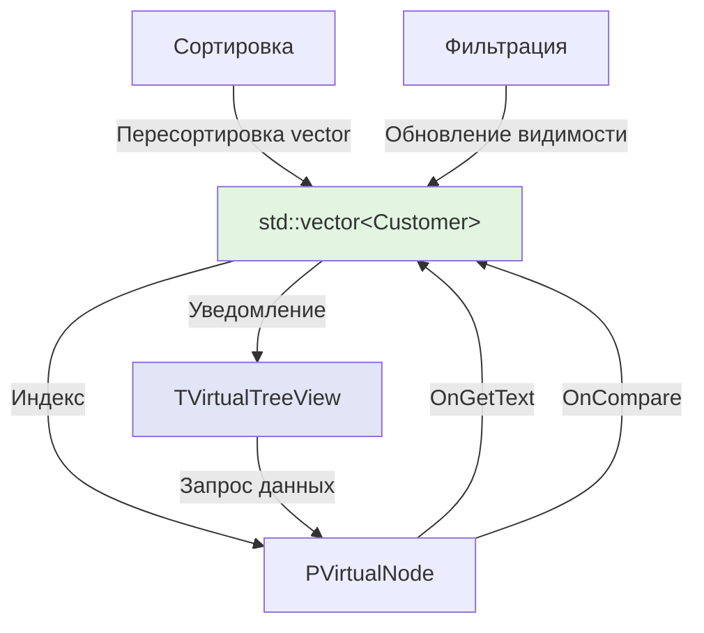

# TVirtualTreeView: Model-View паттерн для C++ Builder

## Концепция виртуального дерева

### Основная идея

**TVirtualTreeView НЕ хранит данные!** Это ключевое отличие от TTreeView.

```
┌─────────────────────────────────────────────────────┐
│  Традиционный подход (TTreeView)                    │
├─────────────────────────────────────────────────────┤
│  Данные → TTreeView → Отображение                   │
│  (смешивание данных и представления)                │
└─────────────────────────────────────────────────────┘

┌─────────────────────────────────────────────────────┐
│  Рекомендуемый подход (TVirtualTreeView)            │
├─────────────────────────────────────────────────────┤
│  std::vector<Data> ←──→ TVirtualTreeView             │
│      (Model)              (View)                     │
│                                                      │
│  • Данные в вашем контейнере                        │
│  • Дерево только отображает                         │
│  • Сортировка/фильтрация в контейнере               │
└─────────────────────────────────────────────────────┘
```

## Рекомендуемая архитектура

### Структура проекта



### Почему так, а не иначе?

**Преимущества подхода Model-View:**

1. **Разделение ответственности**
   - Модель отвечает за данные и бизнес-логику
   - View отвечает только за отображение

2. **Производительность**
   - Сортировка в `std::vector` быстрее, чем перестройка дерева
   - Фильтрация не требует пересоздания узлов

3. **Гибкость**
   - Можно использовать несколько представлений для одних данных
   - Легко менять представление без изменения данных

4. **Простота**
   - Меньше синхронизации данных
   - Один источник истины (Single Source of Truth)

## Реализация на C++ Builder

### Шаг 1: Определение модели данных

```cpp
// Customer.h
class Customer {
private:
    int FID;
    UnicodeString FName;
    UnicodeString FEmail;
    int FAge;
    bool FActive;

public:
    Customer(int AID, UnicodeString AName, UnicodeString AEmail, int AAge, bool AActive)
        : FID(AID), FName(AName), FEmail(AEmail), FAge(AAge), FActive(AActive) {}

    // Геттеры
    int GetID() const { return FID; }
    UnicodeString GetName() const { return FName; }
    UnicodeString GetEmail() const { return FEmail; }
    int GetAge() const { return FAge; }
    bool GetActive() const { return FActive; }

    // Сеттеры
    void SetName(UnicodeString Value) { FName = Value; }
    void SetEmail(UnicodeString Value) { FEmail = Value; }
    void SetAge(int Value) { FAge = Value; }
    void SetActive(bool Value) { FActive = Value; }
};
```

### Шаг 2: Контейнер с данными

```cpp
// MainForm.h
class TMainForm : public TForm {
private:
    // МОДЕЛЬ - хранилище данных
    std::vector<Customer*> FCustomers;
    std::vector<Customer*> FFilteredCustomers;  // Отфильтрованный список

    // VIEW
    TVirtualStringTree *VST;

    void BuildCustomerList();
    void UpdateTreeFromModel();
    void ApplyFilter(UnicodeString FilterText);
    void SortByColumn(int ColumnIndex, bool Ascending);

public:
    __fastcall TMainForm(TComponent* Owner);
    __fastcall ~TMainForm();

    // События дерева
    void __fastcall VSTGetText(TBaseVirtualTree *Sender, PVirtualNode Node,
        TColumnIndex Column, TVSTTextType TextType, UnicodeString &Text);
    void __fastcall VSTInitNode(TBaseVirtualTree *Sender,
        PVirtualNode ParentNode, PVirtualNode Node,
        TVirtualNodeInitStates &InitialStates);
    void __fastcall VSTFreeNode(TBaseVirtualTree *Sender, PVirtualNode Node);
    void __fastcall VSTCompareNodes(TBaseVirtualTree *Sender,
        PVirtualNode Node1, PVirtualNode Node2, TColumnIndex Column, int &Result);
};

// Структура данных узла - ТОЛЬКО ИНДЕКС!
struct TNodeData {
    int CustomerIndex;  // Индекс в векторе FFilteredCustomers
};
typedef TNodeData *PNodeData;
```

### Шаг 3: Инициализация

```cpp
// MainForm.cpp
__fastcall TMainForm::TMainForm(TComponent* Owner) : TForm(Owner) {
    VST->NodeDataSize = sizeof(TNodeData);

    // Заполнение модели данными
    BuildCustomerList();

    // Инициализация дерева
    UpdateTreeFromModel();
}

void TMainForm::BuildCustomerList() {
    // Создание тестовых данных
    FCustomers.push_back(new Customer(1, "Иванов Иван", "ivanov@mail.ru", 30, true));
    FCustomers.push_back(new Customer(2, "Петров Петр", "petrov@mail.ru", 25, true));
    FCustomers.push_back(new Customer(3, "Сидоров Сидор", "sidorov@mail.ru", 35, false));
    FCustomers.push_back(new Customer(4, "Алексеева Анна", "alekseeva@mail.ru", 28, true));
    FCustomers.push_back(new Customer(5, "Смирнов Олег", "smirnov@mail.ru", 42, false));

    // Изначально отфильтрованный список = полный список
    FFilteredCustomers = FCustomers;
}

void TMainForm::UpdateTreeFromModel() {
    VST->BeginUpdate();
    try {
        // Устанавливаем количество корневых узлов = размеру отфильтрованного списка
        VST->RootNodeCount = FFilteredCustomers.size();
    }
    __finally {
        VST->EndUpdate();
    }
}

__fastcall TMainForm::~TMainForm() {
    // Очистка данных
    for (auto customer : FCustomers) {
        delete customer;
    }
    FCustomers.clear();
}
```

### Шаг 4: Связь модели и представления

```cpp
// Инициализация узла - связываем с индексом в векторе
void __fastcall TMainForm::VSTInitNode(TBaseVirtualTree *Sender,
    PVirtualNode ParentNode, PVirtualNode Node,
    TVirtualNodeInitStates &InitialStates)
{
    PNodeData Data = (PNodeData)Sender->GetNodeData(Node);

    // КЛЮЧЕВОЙ МОМЕНТ: храним только индекс!
    Data->CustomerIndex = Node->Index;
}

// Получение текста - читаем из модели по индексу
void __fastcall TMainForm::VSTGetText(TBaseVirtualTree *Sender,
    PVirtualNode Node, TColumnIndex Column, TVSTTextType TextType,
    UnicodeString &Text)
{
    PNodeData Data = (PNodeData)Sender->GetNodeData(Node);

    // Проверяем валидность индекса
    if (Data->CustomerIndex < 0 ||
        Data->CustomerIndex >= (int)FFilteredCustomers.size()) {
        return;
    }

    // Получаем объект из модели
    Customer *Cust = FFilteredCustomers[Data->CustomerIndex];

    // Формируем текст для отображения
    switch(Column) {
        case 0: Text = IntToStr(Cust->GetID()); break;
        case 1: Text = Cust->GetName(); break;
        case 2: Text = Cust->GetEmail(); break;
        case 3: Text = IntToStr(Cust->GetAge()); break;
        case 4: Text = Cust->GetActive() ? "Да" : "Нет"; break;
    }
}

void __fastcall TMainForm::VSTFreeNode(TBaseVirtualTree *Sender,
    PVirtualNode Node)
{
    // Узлы дерева НЕ владеют данными, только ссылаются на них
    // Поэтому здесь ничего не удаляем
}
```

### Шаг 5: Сортировка в модели

```cpp
// Функтор для сортировки
class CustomerComparator {
private:
    int FColumn;
    bool FAscending;

public:
    CustomerComparator(int Column, bool Ascending)
        : FColumn(Column), FAscending(Ascending) {}

    bool operator()(const Customer* a, const Customer* b) const {
        int result = 0;

        switch(FColumn) {
            case 0: // ID
                result = a->GetID() - b->GetID();
                break;

            case 1: // Name
                result = CompareText(a->GetName(), b->GetName());
                break;

            case 2: // Email
                result = CompareText(a->GetEmail(), b->GetEmail());
                break;

            case 3: // Age
                result = a->GetAge() - b->GetAge();
                break;

            case 4: // Active
                result = (int)a->GetActive() - (int)b->GetActive();
                break;
        }

        return FAscending ? (result < 0) : (result > 0);
    }
};

// Метод сортировки
void TMainForm::SortByColumn(int ColumnIndex, bool Ascending) {
    VST->BeginUpdate();
    try {
        // СОРТИРУЕМ МОДЕЛЬ, а не дерево!
        std::sort(FFilteredCustomers.begin(),
                  FFilteredCustomers.end(),
                  CustomerComparator(ColumnIndex, Ascending));

        // Обновляем отображение
        VST->Invalidate();
    }
    __finally {
        VST->EndUpdate();
    }
}

// Обработчик клика по заголовку
void __fastcall TMainForm::VSTHeaderClick(TVTHeader *Sender,
    TVTHeaderHitInfo HitInfo)
{
    if (HitInfo.Button == mbLeft) {
        static int LastColumn = -1;
        static bool Ascending = true;

        if (LastColumn == HitInfo.Column) {
            Ascending = !Ascending;  // Переключаем направление
        }
        else {
            LastColumn = HitInfo.Column;
            Ascending = true;
        }

        // Устанавливаем индикатор сортировки
        Sender->SortColumn = HitInfo.Column;
        Sender->SortDirection = Ascending ? sdAscending : sdDescending;

        // СОРТИРУЕМ МОДЕЛЬ
        SortByColumn(HitInfo.Column, Ascending);
    }
}
```

### Шаг 6: Фильтрация в модели

```cpp
// Применение фильтра
void TMainForm::ApplyFilter(UnicodeString FilterText) {
    VST->BeginUpdate();
    try {
        FFilteredCustomers.clear();

        if (FilterText.IsEmpty()) {
            // Нет фильтра - показываем всё
            FFilteredCustomers = FCustomers;
        }
        else {
            // Фильтруем по имени
            FilterText = FilterText.LowerCase();
            for (auto customer : FCustomers) {
                if (customer->GetName().LowerCase().Pos(FilterText) > 0) {
                    FFilteredCustomers.push_back(customer);
                }
            }
        }

        // ОБНОВЛЯЕМ ДЕРЕВО после изменения модели
        UpdateTreeFromModel();
    }
    __finally {
        VST->EndUpdate();
    }
}

// Обработчик изменения текста фильтра
void __fastcall TMainForm::EditFilterChange(TObject *Sender) {
    ApplyFilter(EditFilter->Text);
}
```

### Шаг 7: Редактирование данных

```cpp
// Изменение данных в модели
void __fastcall TMainForm::VSTNewText(TBaseVirtualTree *Sender,
    PVirtualNode Node, TColumnIndex Column, UnicodeString NewText)
{
    PNodeData Data = (PNodeData)Sender->GetNodeData(Node);

    if (Data->CustomerIndex < 0 ||
        Data->CustomerIndex >= (int)FFilteredCustomers.size()) {
        return;
    }

    // ИЗМЕНЯЕМ ДАННЫЕ В МОДЕЛИ
    Customer *Cust = FFilteredCustomers[Data->CustomerIndex];

    switch(Column) {
        case 1: // Name
            Cust->SetName(NewText);
            break;

        case 2: // Email
            Cust->SetEmail(NewText);
            break;

        case 3: // Age
            try {
                Cust->SetAge(StrToInt(NewText));
            }
            catch(...) {
                ShowMessage("Неверное числовое значение!");
            }
            break;
    }

    // Дерево автоматически обновится
}
```

## Сложные сценарии

### Иерархические данные

```cpp
// Класс для иерархических данных
class TreeNode {
private:
    UnicodeString FCaption;
    std::vector<TreeNode*> FChildren;
    TreeNode* FParent;

public:
    TreeNode(UnicodeString ACaption, TreeNode* AParent = nullptr)
        : FCaption(ACaption), FParent(AParent) {}

    ~TreeNode() {
        for (auto child : FChildren) {
            delete child;
        }
    }

    UnicodeString GetCaption() const { return FCaption; }
    int GetChildCount() const { return FChildren.size(); }
    TreeNode* GetChild(int Index) const { return FChildren[Index]; }
    TreeNode* GetParent() const { return FParent; }

    TreeNode* AddChild(UnicodeString Caption) {
        TreeNode* Child = new TreeNode(Caption, this);
        FChildren.push_back(Child);
        return Child;
    }
};

// Структура узла - указатель на узел модели
struct TTreeNodeData {
    TreeNode* ModelNode;
};

// Инициализация с учетом иерархии
void __fastcall TMainForm::VSTInitNode(TBaseVirtualTree *Sender,
    PVirtualNode ParentNode, PVirtualNode Node,
    TVirtualNodeInitStates &InitialStates)
{
    TTreeNodeData *Data = (TTreeNodeData*)Sender->GetNodeData(Node);

    TreeNode* ParentModelNode;
    if (ParentNode == nullptr || ParentNode == Sender->RootNode) {
        // Корневой узел
        ParentModelNode = FRootNode;
    }
    else {
        // Дочерний узел
        TTreeNodeData *ParentData = (TTreeNodeData*)Sender->GetNodeData(ParentNode);
        ParentModelNode = ParentData->ModelNode;
    }

    // Связываем с узлом модели
    Data->ModelNode = ParentModelNode->GetChild(Node->Index);

    // Устанавливаем флаг наличия детей
    if (Data->ModelNode->GetChildCount() > 0) {
        InitialStates = InitialStates << ivsHasChildren;
    }
}

// Количество дочерних узлов из модели
void __fastcall TMainForm::VSTInitChildren(TBaseVirtualTree *Sender,
    PVirtualNode Node, Cardinal &ChildCount)
{
    TTreeNodeData *Data = (TTreeNodeData*)Sender->GetNodeData(Node);
    ChildCount = Data->ModelNode->GetChildCount();
}
```

### Обновление отдельных узлов

```cpp
// Уведомление дерева об изменении конкретного элемента модели
void TMainForm::UpdateCustomer(int CustomerIndex) {
    // Находим узел, соответствующий этому элементу
    PVirtualNode Node = VST->GetFirst();
    while (Node != nullptr) {
        PNodeData Data = (PNodeData)VST->GetNodeData(Node);
        if (Data->CustomerIndex == CustomerIndex) {
            // Обновляем только этот узел
            VST->InvalidateNode(Node);
            break;
        }
        Node = VST->GetNext(Node);
    }
}

// Пример использования
void __fastcall TMainForm::ButtonUpdateClick(TObject *Sender) {
    // Изменяем данные в модели
    if (FFilteredCustomers.size() > 0) {
        FFilteredCustomers[0]->SetName("Новое имя");

        // Уведомляем дерево
        UpdateCustomer(0);
    }
}
```

### Добавление/удаление элементов

```cpp
// Добавление нового клиента
void __fastcall TMainForm::ButtonAddClick(TObject *Sender) {
    VST->BeginUpdate();
    try {
        // Добавляем в модель
        Customer *NewCust = new Customer(
            FCustomers.size() + 1,
            "Новый клиент",
            "new@mail.ru",
            25,
            true
        );
        FCustomers.push_back(NewCust);

        // Если проходит фильтр, добавляем в отфильтрованный список
        FFilteredCustomers.push_back(NewCust);

        // Обновляем дерево
        VST->RootNodeCount = FFilteredCustomers.size();

        // Фокусируемся на новом узле
        PVirtualNode NewNode = VST->GetLast();
        if (NewNode != nullptr) {
            VST->FocusedNode = NewNode;
            VST->Selected[NewNode] = true;
            VST->ScrollIntoView(NewNode, false);
        }
    }
    __finally {
        VST->EndUpdate();
    }
}

// Удаление клиента
void __fastcall TMainForm::ButtonDeleteClick(TObject *Sender) {
    PVirtualNode Node = VST->FocusedNode;
    if (Node == nullptr) return;

    PNodeData Data = (PNodeData)VST->GetNodeData(Node);
    if (Data->CustomerIndex < 0 ||
        Data->CustomerIndex >= (int)FFilteredCustomers.size()) {
        return;
    }

    Customer *Cust = FFilteredCustomers[Data->CustomerIndex];

    VST->BeginUpdate();
    try {
        // Удаляем из отфильтрованного списка
        FFilteredCustomers.erase(
            FFilteredCustomers.begin() + Data->CustomerIndex
        );

        // Удаляем из основного списка
        auto it = std::find(FCustomers.begin(), FCustomers.end(), Cust);
        if (it != FCustomers.end()) {
            FCustomers.erase(it);
            delete Cust;
        }

        // Обновляем дерево
        VST->RootNodeCount = FFilteredCustomers.size();
    }
    __finally {
        VST->EndUpdate();
    }
}
```

## Оптимизация производительности

### Отложенная загрузка (Lazy Loading)

```cpp
// Для очень больших наборов данных
class LazyDataModel {
private:
    std::vector<Customer*> FAllData;
    std::map<int, Customer*> FLoadedData;  // Кэш загруженных данных

public:
    Customer* GetCustomer(int Index) {
        // Проверяем кэш
        auto it = FLoadedData.find(Index);
        if (it != FLoadedData.end()) {
            return it->second;
        }

        // Загружаем из базы данных или файла
        Customer* Cust = LoadCustomerFromDB(Index);
        FLoadedData[Index] = Cust;
        return Cust;
    }

    int GetCount() const {
        return FAllData.size();
    }
};
```

### Batch-обновления

```cpp
// Массовое обновление данных
void TMainForm::BatchUpdate() {
    VST->BeginUpdate();
    try {
        // Множество операций с моделью
        for (auto customer : FCustomers) {
            customer->SetActive(true);
        }

        // Одно обновление дерева в конце
        VST->Invalidate();
    }
    __finally {
        VST->EndUpdate();
    }
}
```

## Сравнение подходов

### ❌ Неправильный подход

```cpp
// ПЛОХО: данные дублируются в дереве и вашем контейнере
struct TNodeData {
    UnicodeString Name;
    UnicodeString Email;
    int Age;
    // ... все поля дублируются
};

// Приходится синхронизировать два источника данных
void UpdateBoth(UnicodeString NewName) {
    // Обновляем в векторе
    FCustomers[index]->SetName(NewName);

    // Обновляем в дереве
    PNodeData Data = ...;
    Data->Name = NewName;
}
```

### ✅ Правильный подход

```cpp
// ХОРОШО: только индекс или указатель
struct TNodeData {
    int CustomerIndex;  // или Customer* ModelPtr;
};

// Один источник данных
void Update(UnicodeString NewName) {
    // Обновляем только модель
    FCustomers[index]->SetName(NewName);

    // Дерево получит данные через OnGetText
    VST->InvalidateNode(Node);
}
```

## Заключение

### Рекомендации от разработчиков:

1. **Храните данные вне дерева** - используйте `std::vector`, `std::map` или собственные классы
2. **В узлах храните только индексы или указатели** - не дублируйте данные
3. **Делайте сортировку/фильтрацию в модели** - это быстрее и проще
4. **Используйте события для связи** - `OnGetText`, `OnInitNode`, `OnCompareNodes`
5. **Обновляйте дерево после изменений модели** - `InvalidateNode()`, `RootNodeCount`

### Преимущества этого подхода:

- ✅ Высокая производительность
- ✅ Простота кода
- ✅ Легкость отладки
- ✅ Возможность работы с данными независимо от UI
- ✅ Легкость тестирования бизнес-логики
- ✅ Возможность множественных представлений

### Когда использовать другой подход:

Единственный случай, когда можно хранить данные в узлах - это **чисто визуальное дерево** без связи с бизнес-данными (например, дерево UI элементов для редактора интерфейса).

---

**Версия**: 1.0
**Дата**: Ноябрь 2024
**Основано на**: Virtual TreeView MVC Demo (Marian Aldenhövel)
